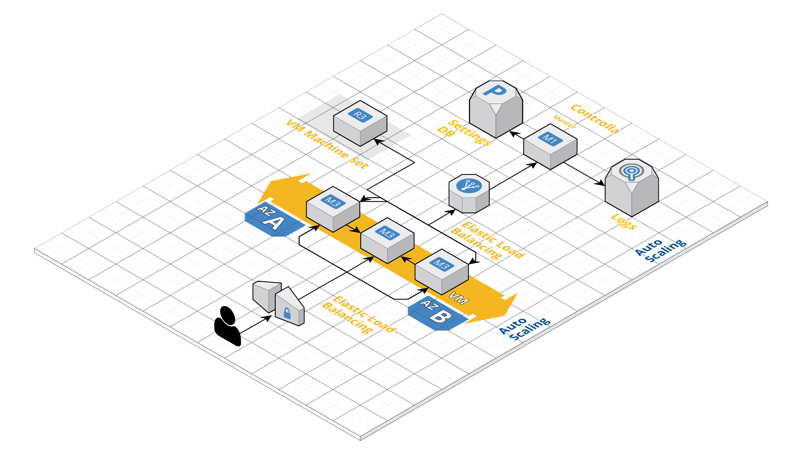

## Slave Worker

HackMoscow 2019 project. A Node Worker for manageable P2P network. Controller repository: https://github.com/SmallShaqs/node-controller

### Description

This is the source code of a node worker which is responsible for handling communication
between other such nodes in a peer connected Virtual Networks on Microsoft Azure.

Nodes act as a bridge between company's computational resources and the network. They communicate with the controller node
to get information about relevant nodes and then send out messages to each node when computation is done. Other nodes are then reponsible for interpreting the data.

### Development

`npm i && npm run dev`

### Startup

`npm i && npm run start`

#### Architecture 

#### Implemented Azure Architecture
- Every node (VM) in the network has its own Virtual Network (VNet) which is peered to each other
- All nodes communicate through gateways and VPN
- A Load Balancer for the main controller Node
- Auto Scaled brought up VM Machine Sets in unique Nodes for intensive CPU computation tasks
- Azure Dashboards with CPU / Bandwidth / IO Ops

#### Implemented Endpoint
- An endpoint to fetch all the VM IP's from a specific Azure Resource

#### Optimizations
- gRPC protocol for intercommunication of services
- ElasticSearch - ELK Stash for logging
- RDS DB for explicit settings, which will control the various nodes.
- Auto Deploy of templates to new nodes